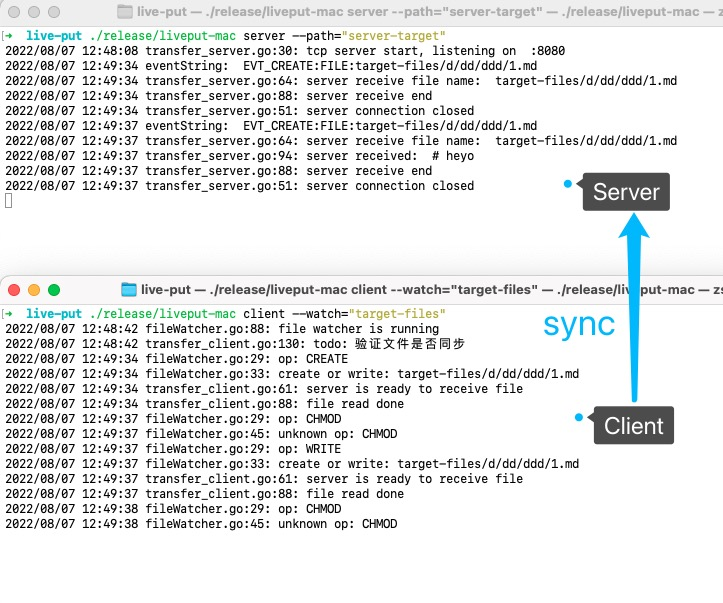

# live put

本地代码修改， 实时同步至远端机器

执行过程截图:



## 快速开始

> 软件包里有client和server

1. 把程序复制到远端机器，并启动

```bash
./liveput-linux -h
./liveput-linux server --path="./server-target"
```

2. 本地启动客户端
```bash
./liveput-mac client -h
./liveput-mac client --watch="./local-dir" --ip="远端ip地址"
```

## doc

### 客户端
liveput 通过tcp实时同步文件

```bash
➜  live-put ./release/liveput-mac client -h                                          
client 监听文件, 并实时同步变化到server端

Usage:
  liveput client [flags]

Flags:
  -h, --help           help for client
      --ip string      服务端ip地址(ipv4), 缺省则默认本机
      --port string    服务端端口号 (default "8080")
      --watch string   要监听的相对路径(当前目录)或绝对路径
```

### 服务端

接收来自client端的文件

```bash
Usage:
  liveput server [flags]

Flags:
  -h, --help          help for server
      --path string   服务端存储的目标目录, 相对当前位置的相对路径或绝对路径
```


## Todo
[x] 文件新增
[x] 文件修改
[x] 文件删除
[x] 文件改名
[ ] Server守护进程
[ ] Client ignore list