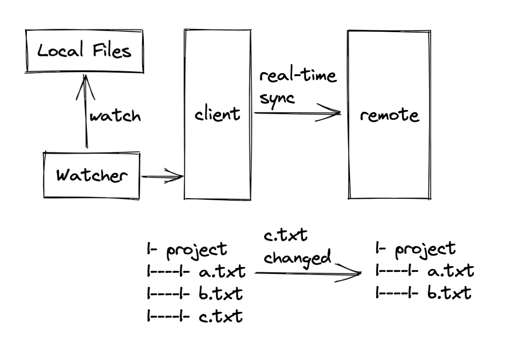

# live put

本地代码修改， 实时同步至远端机器

> 前两天跟小伙伴们聊到了这个有点特殊的场景, 那就~写个工具吧

功能大意:


```sequence
Note left of Watcher: 0. 同步Server文件变化？\nemmm还没想好
Watcher -> Client : 1. 文件变化通知
Client  -> Client : 2. 过滤忽略文件
Client  -> Server : 3. 文件变化通知
Server  -> Server : 4. 文件锁查询
Server  -> Client : 5. 确认变化通知
Client  ->> Server : 6. 文件内容传输
Server  -> Server : 7. 变更文件
Server  -> Client : 8. 变化完成通知
```


## 快速开始

> 软件包里有client和server

1. 把程序复制到远端机器，并启动

```bash
./liveput-linux -h
./liveput-linux server --path="./server-target"
```

2. 本地启动客户端
```bash
./liveput-mac client -h
./liveput-mac client --watch="./local-dir" --ip="远端ip地址"
```

**🎯 完成！**

## doc

### 客户端
liveput 通过tcp实时同步文件

```bash
➜  live-put ./release/liveput-mac client -h                                          
client 监听文件, 并实时同步变化到server端

Usage:
  liveput client [flags]

Aliases:
  client, c

Flags:
  -h, --help           help for client
  -i, --ip string      服务端ip地址(ipv4), 缺省则默认本机
  -p, --port string    服务端端口号 (default "8080")
  -w, --watch string   要监听的相对路径(当前目录)或绝对路径
```

### 服务端

接收来自client端的文件

```bash
Usage:
  liveput server [flags]

Aliases:
  server, s

Flags:
  -h, --help          help for server
  -p, --path string   服务端存储的目标目录, 相对当前位置的相对路径或绝对路径
➜  live-put git:(main) ✗ go run main.go c -h
```


## Todo
[x] 文件新增

[x] 文件修改

[x] 文件删除

[x] 文件改名

[ ] Server守护进程

[ ] Client ignore list

## 对作者的问题

> 问题提出者, 作者

1. 为什么不用ssh呢？
- 因为感觉好麻烦， 学不动
